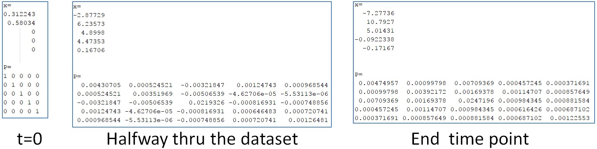
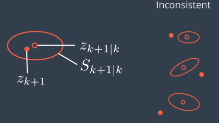

**Self-Driving Car Engineer Nanodegree**

**Term2 – Project2: Unscented Kalman Filter (UKF)**

{width="4.511805555555555in"
height="3.079861111111111in"}

**INTRODUCTION**

The purpose of the project is to estimate the location of a moving
bicycle using 2 given measurements: LIDAR and RADAR. These 2
measurements can be read at any point in time. The estimate will be
computed using an Unscented Kalman Filter (UKF). The UKF will follow a
constant speed, constant yaw rate motion model (CTRV).

**BASIC KF FILTERS IN 1D**

1.  KF can be used to “fuse” 2 measurements using the measurement values
    and uncertainties (on this case the covariance of the standard
    distribution):

On the above case, the existing measurement in **BLACK**, is “fused”
with the new measurement in **BLUE**, to create a new measurement mean
and distribution in **RED**. The formulas used are:

1.  KF can also be used to predict the new location of an object based
    on it’s current speed:

The current estimate is shown in **BLUE**, the speed estimate(converted
to traveled distance) is shown in **GREEN**, and the new estimated
location is shown in **RED**. The formulas are:

**KF IN 2D**

KF can be extended to a 2D space (formulas are in document
sensor-fusion-ekf-reference.pdf), in which the state vector is defined
as position Px, Py and velocities Vx, Vy. The prediction and update step
formulas are shown below:

**WHY UNSCENTED KF?**

The CTRV model used consists of 5 variables: Px, Py, V, yaw, yaw\_rate:

Since the state is assumed to follow a Gaussian normal distribution and
getting a measurement from RADAR and converting it thru the process
model is a non-linear process, UKF solve this without the need of a
difficult numerical method. The UKF creates “Sigma points” that bound
the state and those sigma points can then be passed thru the process
function. This creates “predicted” sigma points. Those “predicted” sigma
points can then be used in the updated step also (for RADAR only).

The state vector is “augmented” by the noise covariance matrix values
also.

**CODE FLOWCHART**

The project code follows the flowchart shown in UDACITY’s website:

The above flowchart is put into C++ code in the UKF.cpp file. It
contains the following functions:

-UKF::Prediction

-computes sigma points for the augmented state

-passes sigma points thru the process model

-computes a predicted state x and covariance matrix P using weights

UKF::UpdateLidar

-compares the LIDAR measurement to the predicted state for Px and Py

-applies a regular KALMAN filter to compute the updated state x and
covariance matrix P

-it also computes the Normalized Innovation Squared(NIS) metric

UKF::UpdateRadar

> -transform the predicted state sigma points into the RADAR space and
> compares it to the RADAR measurement
>
> -computes the updated state x and covariance P by using cross
> correlation between sigma points in state and measurement spaces

-it also computes the Normalized Innovation Squared(NIS) metric

The tools.cpp: defines the Root Mean Squared (RMSE) function

**INSTRUMENTATION COVARIANCE MATRICES**

Both RADAR and LASER covariance values are given:

These values come from the equipment manufacturer. They are not
cross-correlated (i.e. the values form a diagonal matrix):

R\_laser\_ &lt;&lt; 0.15, 0.00,

0.00, 0.15;

R\_radar\_ &lt;&lt; 0.30, 0.00, 0.00,

0.00, 0.03, 0.00,

0.00, 0.00, 0.30;

**PROCESS COVARIANCE MATRIX**

The std\_a\^2 and std\_yawdd\^2 values in the process covariance matrix
were estimated as follows:

-Maximum accel for a bicycle = 1g/5 = 2m/s2. Using ½ of 2m/s2 yields
***1m/s2*** for std\_a

-maximum yaw rate accel 45deg/s in 2.6s =&gt; 0.30rad/s2. Using ½ of
this quantity yields ***0.15rad/s2*** for sigma\_yawdd

**INITIALIZATION OF STATE X AND MATRICES**

-The first recived measurement defines the state x. If it comes from
LIDAR, Px and Py are used. If it comes from RADAR, rho, phi, and rhodot
are converted into Px , Py, and V. Yaw and YawRate are set to 0.

x= 0.312243

0.58034

0

0

0

-The covariance matrix is initialized as an identity matrix (5x5):

P= 1 0 0 0 0

0 1 0 0 0

0 0 1 0 0

0 0 0 1 0

0 0 0 0 1

**NUMERICAL CONSIDERATIONS**

The kalman\_filter.cpp file contains the Extended KF routine. It
converts the current state to polar coordinates so that they can be
“fusioned” with the new RADAR (polar) measurements. Two quantities had
to be checked to ensure numerical accuracy of the code:

1.  On the updateRadar step, in the computation of rho\_dot, if the
    denominator vel if less than 0.0001, it will be set to 0.0001 to
    avoid division by zero. A warning message will appear on the screen.

2.  When taking the difference of 2 angles, it is necessary to
    “normalize” the difference to ensure that the range of y stays
    within the boundaries of –pi and +pi.

    

    There are 2 ways of doing this:

    a.  IF loop: if angle\_diff &lt; -pi , then add +2pi . If
        angle\_diff &gt; pi, then substract 2 pi. The problem with this
        method is that it introduces a discontinuity in
        the calculations.

    b.  A much better approach is to use Trigonometry to ensure the y
        value stays within bounds. The arc tangent of sin(angle) divided
        by cos(angle). This is accomplished by coding: angle\_diff
        = atan2(sin(angle\_diff) / cos(angle\_diff))

**RESULTS FOR STATE AND COVARIANCE AT DIFFERENT TIMEPOINTS**

The image below shows how the state and covariance values changed from
“time zero” to halfway thru the simulation, until the end point for
comparison:

It can be seen that the assumed initial identity covariance matrix
changes into a symmetric matrix that has the highest values on the
diagonal terms.

**ACCURACY OF COMPUTATIONS**

The accuracy of the KF computations is calculated using a Root Mean
Squared (RMS) formula with respect to the ground truth of the moving
vehicle:

**Normalized Innovation Squared(NIS)**

Is a check for consistency of the prediction against a chi-squared
distribution. It gives you an indication of underestimating or
overestimating the uncertainty of the system. The figure below shows an
example of a case where the uncertainty of the system is being
underestimated.

The model was run twice changing the process noise parameters: once with
std\_a=30m/s and std\_yawdd=30rad/s2 (shown below in BLUE) and with the
chosen values of std\_a=1m/s2 and std\_yawdd=0.15rad/s2 (shown below in
ORANGE)

Decreasing the process noise parameters, resulted in higher NIS values,
but still below the chi-squared 5% max line. The RMSE results were
significantly lower, thus producing good RMSE for dataset1 and dataset2.

The RMSE values for the Dataset 1 are shown below:

The RMSE values for the Dataset 2 are shown below:

